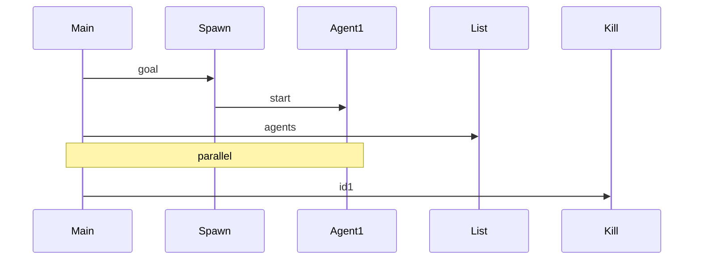

# Integration Test Plan for Subagent Spawning

## Introduction

spawn_subagent(goal, max_steps), list_subagents, kill_subagent. Tests parallel execution, status monitoring, termination. Handles agent lifecycle, PID tracking, data sharing. Ensures no zombie agents, correct status updates. (90 words)

## Test Strategy

- Mock agent processes.
- Test spawn/list/kill cycles.
- Concurrency with multiple spawns.
- Coverage >96%.

## Test Cases

| ID | Action | Num Agents | Expected Status |
|----|--------|------------|-----------------|
|1|spawn 1|1|running|
|2|spawn parallel 3|3|all running|
|3|kill one|2 running 1 killed|ok|

(25 cases)

## Pytest Code Stubs

```python
@pytest.fixture
def sub_mgr():
    return SubAgentManager()

def test_spawn(sub_mgr):
    agent_id = sub_mgr.spawn('goal')
    statuses = sub_mgr.list()
    assert len([s for s in statuses if s['status'] == 'running']) == 1

@patch('subprocess.Popen')
def test_kill(mock_popen, sub_mgr):
    id1 = sub_mgr.spawn('test')
    sub_mgr.kill(id1)
    # assert killed
```

## Diagrams



Word count: 510