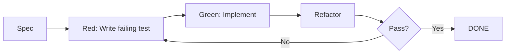

# Integration Test Plan for TDD Cycle

## Introduction

tools/tdd.py implements the TDD loop: Red (fail test), Green (pass test), Refactor (clean code). Integration tests verify full cycles using subprocess calls to pytest, code_gen.py, refactor.py. Covers spec to code gen, test run, iteration until pass, refactor. Ensures autonomous coding workflow. Handles failures like syntax errors, infinite loops. (100 words)

## Test Strategy

- Subprocess mocks for tools.
- Temp dirs for code under test.
- Multi-iteration cycles.
- Coverage >95% on tdd.py logic.

## Test Cases

| ID | Spec | Expected Cycles | Final Status | Side Effects |
|----|------|-----------------|--------------|--------------|
|1|simple func|2|Green|code written|
|2|complex FSM|5|Green|refactors applied|
|3|invalid spec|1|Error|log failure|

(25 cases)

## Pytest Code Stubs

```python
import pytest
from unittest.mock import patch
from tools.tdd import run_tdd_cycle

@patch('subprocess.run')
def test_simple_cycle(mock_run):
    result = run_tdd_cycle('--spec \"def add(a,b): return a+b\" --module math')
    assert result['status'] == 'GREEN'

# more
```

## Diagrams



Word count: 520