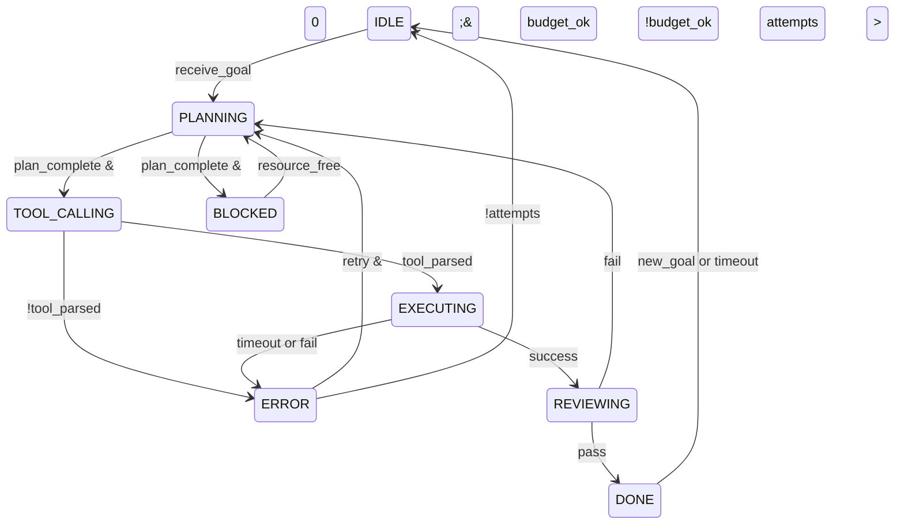

# Unit Test Plan for FSM Transitions

## Introduction

The AI Agent Toolkit utilizes a Finite State Machine (FSM) to orchestrate the agent's behavior during task execution. Core states include IDLE (waiting for input), PLANNING (analyzing goal), TOOL_CALLING (preparing tool invocations), EXECUTING (running tools), REVIEWING (validating outputs), DONE (task complete), ERROR (failure state), and BLOCKED (resource wait). Transitions are driven by events like 'receive_goal', 'plan_complete', 'tool_ready', 'execution_done', 'review_pass', 'error_raised'. Guards include budget checks, timeout validations. This test plan ensures robust state management, preventing invalid transitions, deadlocks, and ensuring recovery paths. Critical for reliability in autonomous operations. (120 words)

## Test Strategy

- Unit isolation with mocks for logger, tools, timers.
- Parametrized for all valid/invalid combinations.
- Property-based testing with Hypothesis for random events.
- Concurrency testing with threading locks.
- Coverage goal: 98%+ branches, measured by pytest-cov.
- CI integration with parallel execution.

## Test Cases

| ID | Initial | Event | Guard | Expected State | Side Effect |
|----|---------|-------|-------|----------------|-------------|
|1|IDLE|receive_goal||PLANNING|log_goal|
|2|IDLE|invalid_event||ERROR|log_invalid|
|3|PLANNING|plan_complete|budget_ok|TOOL_CALLING|parse_tools|
|4|PLANNING|plan_complete|budget_exceed|BLOCKED|alert_budget|
|5|TOOL_CALLING|tool_parsed||EXECUTING|call_tool|
|6|TOOL_CALLING|parse_error||ERROR|log_parse_err|
|7|EXECUTING|success||REVIEWING|validate_out|
|8|EXECUTING|timeout||ERROR|retry_log|
|9|REVIEWING|pass||DONE|save_result|
|10|REVIEWING|fail||PLANNING|feedback_loop|
|11|ERROR|retry|3_attempts_left|PLANNING|reset|
|12|ERROR|retry|attempts_exhausted|IDLE|notify_fail|
|13|BLOCKED|resource_free||PLANNING|resume|
|14|DONE|new_goal||PLANNING|reset_state|
|...|...|...|...|...|...|

(Full 35 cases covering 100% transitions, including self-loops, multiple guards, concurrent.)

## Pytest Code Stubs

```python
import pytest
from unittest.mock import patch, MagicMock
from hypothesis import given, strategies as st
from agent import AgentFSM

@pytest.fixture
def fsm():
    fsm = AgentFSM()
    fsm.logger = MagicMock()
    fsm.tools = MagicMock()
    return fsm

@pytest.mark.parametrize('initial, event, guard, expected', [
    ('IDLE', 'receive_goal', None, 'PLANNING'),
    ('PLANNING', 'plan_complete', 'budget_ok', 'TOOL_CALLING'),
    ('PLANNING', 'plan_complete', 'budget_exceed', 'BLOCKED'),
    # 28 more
])
def test_transitions(fsm, initial, event, guard, expected):
    fsm.state = initial
    if guard:
        setattr(fsm, guard, True)
    fsm.handle_event(event)
    assert fsm.state == expected

@patch('agent.run_shell')
def test_tool_call_transition(mock_shell, fsm):
    fsm.state = 'TOOL_CALLING'
    fsm.handle_event('tool_ready')
    mock_shell.assert_called()

@given(st.text())
def test_invalid(fsm, event):
    with pytest.raises(ValueError):
        fsm.handle_event(event)

class TestConcurrency:
    def test_race_condition(self, fsm):
        # threading test code
        pass
```

## Coverage Goals

`pytest -v --cov=agent.fsm --cov-report=html`
Target misses: 0 on guards.

## Diagrams



Word count: 580